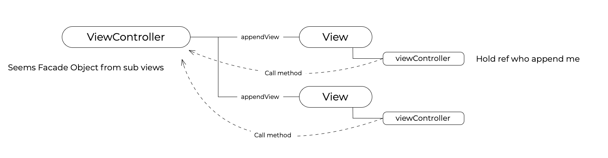
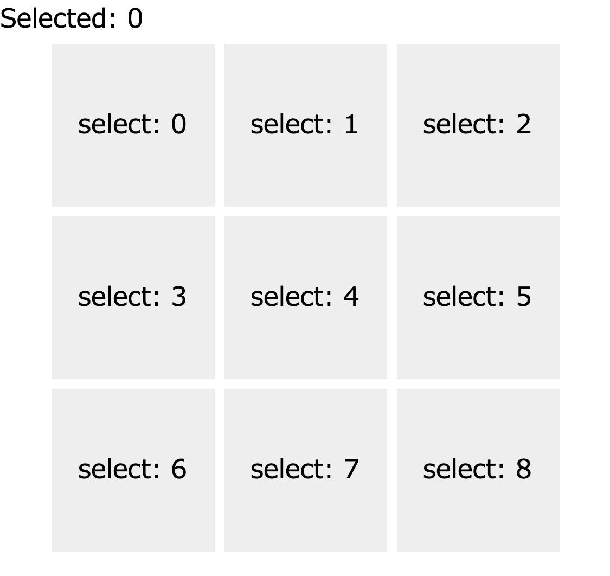

# CraftKit Best Practices: Cascading ViewController and GoF Facade Pattern

CraftKit's design philosophy emphasizes simplicity and effectiveness in managing UI components and their interactions. A crucial part of this approach involves the use of cascading ViewControllers and the application of the Facade pattern from the Gang of Four (GoF) design patterns. These concepts are instrumental in creating a structured and manageable codebase.

## Cascading ViewController



In CraftKit, when you append a sub-view to another view, the ViewController of the parent is automatically cascaded to the child. This behavior ensures that all sub-views within a view hierarchy share a common ViewController context, facilitating coordinated actions and data sharing.

This automatic cascading is handled by `Craft.Core.Component#appendSubView` (or `appendView`) methods:

```javascript
if (this.viewController) {
  component.setViewController(this.viewController);
}
```

Similarly, when appending a sub-view directly to a ViewController, the same cascading principle applies, achieved through `Craft.Core.DefaultViewController#appendSubView` (or `appendView`). Therefore, to create your custom ViewController, extending `DefaultRootViewController` is recommended:

```javascript
component.setViewController(this);
```

This unified approach allows for intuitive interaction between multiple ViewControllers within the same page (or DOM), such as having a ModalViewController on top of a PageController.

## ViewController as a Facade

To streamline complex object relationships across components, employing the Delegate pattern is advisable. However, with the automatic cascading of ViewControllers, a Facade-like pattern can also emerge, centralizing communication and interaction handling within the ViewController.

Consider an application that displays a grid of panels. When a panel is clicked, it highlights the selected number:



```javascript
class PanelController extends Craft.UI.DefaultViewController {
  viewDidLoad(callback) {
    for (let i = 0; i < 9; i++) {
      let p = new Panel({
        delegate: this,
        num: i,
      });
      this.appendView({
        id: "container",
        component: p,
      });
    }
    if (callback) {
      callback();
    }
  }
  forcus(num) {
    this.shadow.getElementById("forcus").innerHTML = num;
  }
  style(componentId) {
    return `
      .root { box-sizing:border-box; }
      #container {
        width: 318px;
        display:flex; flex-direction:row; flex-wrap:wrap;
        margin-right:auto; margin-left:auto;
      }
    `;
  }
  template(componentId) {
    return `
      <div class="root">
        <div>
          Selected: <span id="forcus"></span>
        </div>
        <div id="container"></div>
      </div>
    `;
  }
}
class Panel extends Craft.UI.View {
  constructor(options) {
    super(options);
    this.delegate = options.delegate;
    this.data = { num: options.num };
  }
  style(componentId) {
    return `
      .root {
        box-sizing:border-box;
        width:100px; height:100px; margin:3px;
        background-color:#eee;
        display: flex;
        justify-content: center;
        align-items: center;
      }
    `;
  }
  template(componentId) {
    return `
      <div class="root">
        <div onclick="${componentId}.delegate.forcus(${componentId}.data.num)">
          select: ${this.data.num}
        </div>
      </div>
    `;
  }
}
```

In this structure, `PanelController` acts as a Facade, offering a simplified interface for `Panel` instances to interact with. The cascading of ViewControllers enables `Panel` to call `focus` on the `PanelController` without direct delegation:

```javascript
class PanelController extends Craft.UI.DefaultViewController {
  viewDidLoad(callback) {
    for (let i = 0; i < 9; i++) {
      let p = new Panel({
        num: i,
      });
      this.appendView({
        id: "container",
        component: p,
      });
    }
    if (callback) {
      callback();
    }
  }
  forcus(num) {
    this.shadow.getElementById("forcus").innerHTML = num;
  }
  style(componentId) {
    return `
      .root { box-sizing:border-box; }
      #container {
        width: 318px;
        display:flex; flex-direction:row; flex-wrap:wrap;
        margin-right:auto; margin-left:auto;
      }
    `;
  }
  template(componentId) {
    return `
      <div>
        <div>
          Selected: <span id="forcus"></span>
        </div>
        <div id="container"></div>
      </div>
    `;
  }
}
class Panel extends Craft.UI.View {
  constructor(options) {
    super(options);
    this.data = { num: options.num };
  }
  style(componentId) {
    return `
      .root {
        box-sizing:border-box;
        width:100px; height:100px; margin:3px;
        background-color:#eee;
        display: flex;
        justify-content: center;
        align-items: center;
      }
    `;
  }
  template(componentId) {
    return `
      <div class="root">
        <div onclick="${componentId}.viewController.forcus(${componentId}.data.num)">
          select: ${this.data.num}
        </div>
      </div>
    `;
  }
}
```

This pattern reduces the need for explicit delegation, allowing the ViewController to manage interactions and data flows more effectively, akin to a Facade in traditional design patterns.

## Practical Application

These examples illustrate the power and flexibility of CraftKit's approach to UI component management. By leveraging cascading ViewControllers and applying Facade-like patterns, developers can create complex, interactive applications with simpler, more maintainable code.

The examples provided are ready to run in the CraftKit Playground, offering a hands-on experience with these architectural patterns. Experiment with these concepts to enhance your CraftKit applications:

```javascript
var view = new PanelController();
view.loadView();
Craft.Core.Context.getRootViewController().appendSubView(view);
```

Visit the [CraftKit Playground](https://github.com/craftkit/craftkit-playground) to explore further and apply these best practices in your projects.
