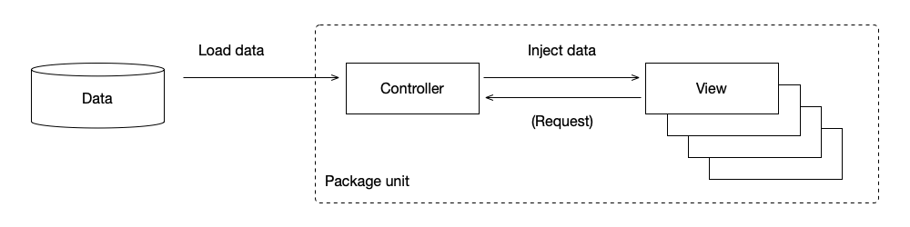

# CraftKit Best Practices: Data Injection for Remote Data Updates

Updating views with data fetched asynchronously from remote sources is a common challenge in web application development. Handling this efficiently without causing UI lag or stacking delays requires a thoughtful approach.

## Best Practice: Data Injection Pattern

The "Data Injection" pattern, which involves loading data and then creating its view, is considered a best practice for managing asynchronous data updates. This approach advocates for the use of a controller class to handle remote data fetching and subsequently create factorized views based on the loaded data.



### Why Data Injection?

This methodology aligns with the GoF Facade pattern or a simplified MVC (Model-View-Controller) structure, often encapsulating reusable logic within the controller. When views require remote data, they should delegate the request to the controller, concentrating complexity in a single location and facilitating maintenance.

## Implementation Example

Consider a sample remote data structure similar to one used in managing sub-views for array data. Here, we implement a controller to load and display a list of products:

```javascript
[
  { name: "Apple", price: 10 },
  { name: "Orange", price: 13 },
  { name: "Strawberry", price: 20 },
  { name: "Pear", price: 9 },
];
```

https://craftkit.dev/craftkit-playground/sampledata/simple_products.json

```javascript
class ProductListController extends Craft.UI.View {
  constructor(options) {
    super(options);
    this.data = { products: [] };
    this.views = { current: null };
  }
  viewDidLoad(callback) {
    this.loadData();
    this.renderReloadBtn();
    if (callback) callback();
  }
  loadData() {
    this.renderLoading();

    let xhr = new XMLHttpRequest();
    xhr.onload = () => {
      this.data.products = JSON.parse(xhr.response);
      this.renderProductList();
    };
    xhr.open(
      "GET",
      "https://craftkit.dev/craftkit-playground/sampledata/simple_products.json"
    );
    xhr.send();
  }
  renderLoading() {
    let view = new Loading();
    this.replaceView({ id: "list", component: view });
    this.views.current?.unloadView(); // Quick and dirty cleanup
    this.views.current = view;
  }
  renderProductList() {
    let view = new ProductList({ delegate: this });
    this.replaceView({ id: "list", component: view });
    this.views.current?.unloadView(); // Another quick and dirty cleanup
    this.views.current = view;
  }
  renderReloadBtn() {
    this.appendView({
      id: "btn",
      component: new ReloadBtn({ delegate: this }),
    });
  }
  style(componentId) {
    return `
      #btn { background-color: #eee; }
    `;
  }
  template(componentId) {
    return `
      <div id="root" class="root">
      <div id="list"></div>
      <div id="btn"></div>
      </div>
    `;
  }
}

class Loading extends Craft.UI.View {
  template(componentId) {
    return `<div>Loading...</div>`;
  }
}
class ReloadBtn extends Craft.UI.View {
  constructor(options) {
    super(options);
    this.delegate = options.delegate;
  }
  reloadData() {
    this.delegate.loadData();
  }
  style(componentId) {
    return `.root { cursor: pointer; }`;
  }
  template(componentId) {
    return `
      <div id="root" class="root" onclick="${componentId}.reloadData();">
        Reload data
      </div>
    `;
  }
}

class ProductList extends Craft.UI.View {
  constructor(options) {
    super(options);
    this.delegate = options.delegate;
    this.views = { products: [] };
  }
  viewDidLoad(callback) {
    this.delegate.data.products.forEach((p) => {
      let view = new Product(p);
      this.appendView(view);
      this.views.products.push(view);
    });
  }
}
class Product extends Craft.UI.View {
  constructor(options) {
    super(options);
    this.data = options;
  }
  template(componentId) {
    return `
      <div id="root" class="root">
        ${this.data.name} : ${this.data.price}
      </div>
    `;
  }
}
```

In this structure, the controller not only fetches data but also manages the transition between loading states and displaying the product list, effectively handling the complexities of asynchronous data management.

### Advantages

- **Separation of Concerns**: Delegating data fetching to a controller simplifies view components, making them more focused on presentation.
- **Reusability**: Controllers can serve as reusable data management modules across different parts of the application.
- **Maintainability**: Centralizing data fetching and state management logic in controllers makes the application easier to maintain and update.

### Practical Use

These examples are designed to run directly in the CraftKit Playground, providing a practical way to experiment with and understand the data injection pattern.

🛺 Explore CraftKit Playground: [https://craftkit.dev/craftkit-playground](https://craftkit.dev/craftkit-playground)

### Choosing the Right Approach

There are two primary methods for implementing data views: "load data then make its view" and "make view and load its data." The former simplifies view management at the cost of potentially complex object relations, while
