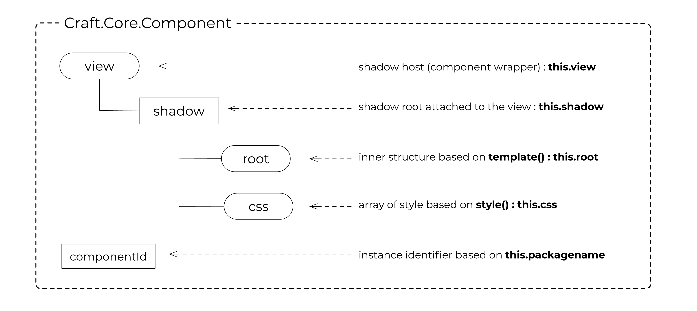
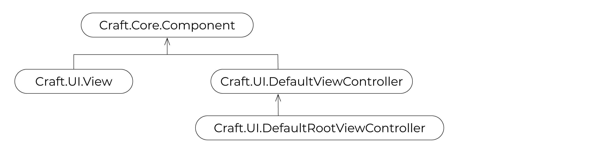
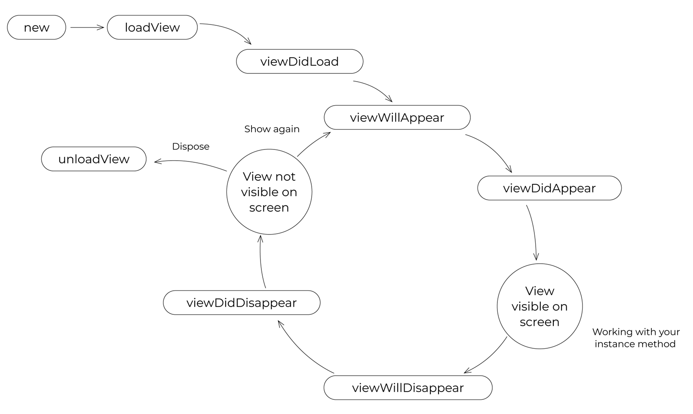

# Craft-UIKit Basic Concepts

Craft-UIKit is a comprehensive JavaScript UI library tailored for OOP development in the Clear Web ecosystem.

Explore and learn more through the online tutorial:  
[Craft-UIKit Playground on GitHub](https://github.com/craftkit/craftkit-playground)

## Overview of Component



At the heart of Craft-UIKit lies the `Craft.Core.Component` base class. It encompasses the shadow host, shadow root, the DOM tree under the shadow, associated styles, and actions.

Each instance of `Component` is uniquely identified by a `componentId`. This identifier is generated automatically using the class variable `packagename` followed by a sequential number, ensuring unique identification in a global scope. In the absence of a `packagename`, the class name is used instead.

A component instance, being a JavaScript object, can be accessed from anywhere using its `componentId`.

### Example Usage

Consider a class with a `packagename` of `MyApp.Hello`. Your **componentId** might look something like `MyApp_Hello_0`.

```
console:

> var hello_world = new HelloWorld();
> hello_world.loadView();
> document.body.appendChild(hello_world.view);

> MyApp_HelloWorld_0
HelloWorld {packagename: "MyApp.HelloWorld", componentId: "MyApp_HelloWorld_0", view: div#MyApp_HelloWorld_0, css: Array(1), …}

> MyApp_HelloWorld_0.view
<div id="MyApp_HelloWorld_0">...</div>

> MyApp_HelloWorld_0.shadow
#shadow-root (open)

> MyApp_HelloWorld_0.root
<div class="root">...</div>

> MyApp_HelloWorld_0.css
[style#MyApp_HelloWorld_0_1]

> MyApp_HelloWorld_0.say()
(say() is invoked -> displays "Hello World!" on the page)
```

Notes:
- A dot (`.`) in the `packagename` is replaced with an underscore (`_`).
- The `componentId` includes an automatically generated serial number suffix.

## View and ViewController



The `Component` is further specialized into `View` (`Craft.UI.View`) and `ViewController` (`Craft.UI.DefaultViewController`), both extending `Craft.Core.Component`. The `View` encapsulates a template, style, and actions, while the `ViewController` acts as a container for multiple `View` instances and manages them.

An application may include a special `ViewController` known as `RootViewController` (`Craft.UI.DefaultRootViewController`), which serves as the root element of the application. It should be set using `Craft.Core.Context.setRootViewController` at the application's start. The `RootViewController` is also responsible for managing the popstate event and history through an appropriate interface.

### Hello World Example

```javascript
class HelloWorld extends Craft.UI.DefaultViewController {
    constructor(){
        super();
        this.packagename = 'MyApp.HelloWorld';
    }
    viewDidLoad(callback){
        this.hello = new Hello();
        this.world = new World();
        if(callback){ callback(); }
    }
    say(){
        this.appendView(this.hello);
        this.appendView(this.world);
    }
    style(componentId){
        return `
            :host { width: 100%; }
            .root { display flex; flex-direction: row; }
        `;
    }
    template(componentId){
        return `
            <div class='root'></div>
        `;
    }
}

class Msg extends Craft.UI.InlineBlockView {
    style(componentId){
        return `
            .root { margin: 10px; }
            .msg { color: blue; }
        `;
    }
    template(componentId){
        return `
            <div class='root'>
                <span class='msg'>${this.msg}</span>
            </div>
        `;
    }
}

class Hello extends Msg {
    constructor(){
        super();
        this.packagename = 'MyApp.Hello';
        this.msg = 'Hello';
    }
}

class World extends Msg {
    constructor(){
        super();
        this.packagename = 'MyApp.World';
        this.msg = 'World!';
    }
    style(componentId){
        return super.style(componentId) + `
            .msg { color: red; }
        `;
    }
}
```

## Template and Style

The `template()` function defines the component's DOM structure, starting with a single root element. This HTML is interpreted as a template and transformed into a DOM fragment by `Craft.Core.Component.renderView`, with its first element becoming `this.root`.

For defining `id` and `class` in the root element, use 'root' for simplicity and consistent styling across superclasses.

### Good and Bad Template Practices

```html
<!-- Good Example -->
<div>
    <span>Hello world!</span>
</div>

<!-- Bad Example: Multiple root elements -->
<div>
    <span>Hello</span>
</div>
<div>
    <span>world!</span>
</div>

<!-- Also Bad: Including non-element nodes at the root -->
<!-- hello message: this is also a DOM -->
<div>
    <span>Hello world!</span>
</div>
```

Styles for components are managed through **this.css**, defined by the `style()` method. This method returns standard CSS styles and can target the host element using the `:host` pseudo-class. To incorporate styles from a superclass, simply concatenate your additional styles to the superclass's styles.

```javascript 
style(){
    return super.style() + `
        .msg { color: red; }
    `;
}
```

The first argument for both `template()` and `style()` methods is the component's `componentId`, which is consistent with `this.componentId`. Although not always necessary in the `style` method, it might be required to ensure styles cascade properly from the superclass. In the `template` method, it's utilized for accessing component methods.

## Component Method Invocation

To invoke instance methods from within the template, you can use the `${componentId}` syntax.

```javascript 
class Wow extends Craft.UI.View {
    say(msg){
        alert(`oh ${msg}`);
    }
    template(componentId){
        return `
            <div onclick='${componentId}.say("wow")'>Say wow</div>
        `;
    }
}
```

Alternatively, if you prefer using `self` to refer to the instance:

```javascript 
class Wow extends Craft.UI.View {
    say(msg){
        alert(`oh ${msg}`);
    }
    template(self){
        return `
            <div onclick='${self}.say("wow")'>Say wow</div>
        `;
    }
}
```

This shortcut, mapping `componentId` to window scope, enables simpler invocation but is not enabled by default. Set `Craft.Core.Defaults.ALLOW_COMPONENT_SHORTCUT` to `true` at the start of your application to use it. If not using this shortcut, method invocation requires a more verbose syntax.

```javascript 
onclick="window.Craft.Core.ComponentStack.get('${componentId}').say('wow')"
```

For public library development, it's recommended to use the fully qualified component access in templates to ensure compatibility without shortcuts.

## Component Lifecycle and Management

Craft-UIKit defines a set of lifecycle methods that you should honor when creating your own ViewControllers to ensure a smooth and predictable component lifecycle, similar to how `Craft.Core.Component`, `Craft.UI.View`, and `Craft.UI.DefaultViewController` operate.



Lifecycle methods include:
- `loadView`: Prepares `this.view` and `this.css`.
- `viewDidLoad`: Triggered after `loadView`.
- `viewWillAppear`: Before the component's view is added to the DOM.
- `viewDidAppear`: After the component's view is added to the DOM.
- `viewWillDisappear`: Before the component's view is removed from the DOM.
- `viewDidDisappear`: After the component's view is removed from the DOM.
- `unloadView`: Cleans up the view and styles.

Additionally, methods such as `appendSubView`, `removeSubView`, and `removeFromParent` are used for managing component views and their placement within the parent.

## Routing and RootViewController

Craft-UIKit entrusts the `RootViewController` with routing responsibilities. Upon application startup through `Craft.Core.Bootstrap`, a `popstate` event listener is set up to handle navigation events, typically managed by a `Router`. The default implementation uses `Craft.Core.HashRouter`, but a `PathRouter` is also available, and custom routers can be implemented as needed.

Routing logic is implemented within the `resolveRoutingRequest` method of your `PageController`, allowing you to define custom navigation behavior based on the route.

## Booting the Application

The application's entry point is `Craft.Core.Bootstrap.boot`, invoked on `window.onload`. This function requires a configuration object with a `didBootApplication` function, marking the true start of your application. To initiate routing immediately, invoke `bringup` on your `RootViewController`.

```javascript 
window.onload = function(){
    Craft.Core.Defaults.ALLOW_COMPONENT_SHORTCUT = true;
    Craft.Core.Bootstrap.boot({
        router : Craft.Core.PathRouter,
        didBootApplication : function(){
            const rootViewController = new PageController();
            Craft.Core.Context.setRootViewController(rootViewController);
            rootViewController.bringup();
        }
    });
};
```

This documentation and playground aims to provide a clearer understanding of Craft-UIKit, focusing on the essential elements, usage examples, and best practices for developing robust web applications.
