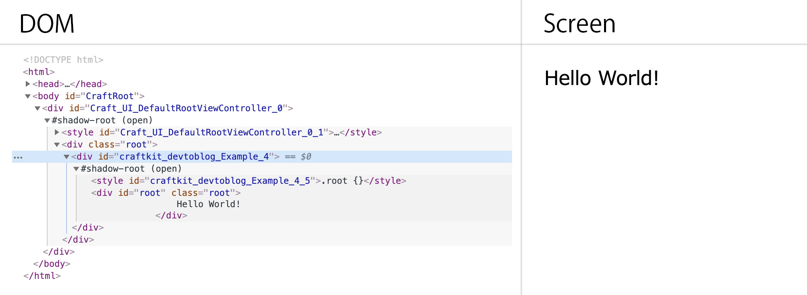

# CraftKit Tips: Using Package Name as Instance Identifier

CraftKit provides a unique mechanism for identifying instances of `Craft.UI.View` on the DOM tree. Each instance is assigned a unique ID and is registered within the global window object. By default, instances are named using the class name appended with a serial number, ensuring uniqueness across the application. However, for enhanced identification, particularly in complex applications or when integrating multiple packages, the `packagename` class variable can be utilized.

## Default Instance Identification

Without specifying a `packagename`, instances are identified by their class name and a trailing serial number:

```javascript
class Example extends Craft.UI.View {
  template(componentId) {
    return `
      <div id="root" class="root">
        Hello World!
      </div>
    `;
  }
}

var view = new Example();
view.loadView();
Craft.Core.Context.getRootViewController().appendSubView(view);
```

This method ensures that each instance, such as `Example_2`, is unique, even as more instances of the `Example` class are added or when the class is included in different packages.


## Enhanced Identification with `packagename`

To facilitate more precise identification by ID, incorporating the `packagename` class variable is recommended:

```javascript
class Example2 extends Craft.UI.View {
  constructor(options) {
    super(options);
    this.packagename = "com.craftclay.Example";
  }
  template(componentId) {
    return `
      <div id="root" class="root">
        Hello World!
      </div>
    `;
  }
}

var view2 = new Example2();
view2.loadView();
Craft.Core.Context.getRootViewController().appendSubView(view2);
```

With `packagename` defined, the instance of the `Example` class is named using a more detailed identifier, such as `id: craftkit_devtoblog_Example_4`. This naming convention not only provides a clear association with the specific package and class but also aids in navigating and surveying the instance pool in larger applications.



## Considerations

The usage of `packagename` offers several benefits:

- **Enhanced Clarity**: It makes it easier to trace back instances to their respective classes and packages, especially in the developer tools or when debugging.
- **Namespace Organization**: It helps organize instances in a hierarchical manner, reflecting their origins and relationships within the application's architecture.
- **Flexibility**: The `packagename` does not have to strictly adhere to the module name, allowing for custom identifiers based on project needs or naming conventions.

Adopting the `packagename` for instance identification in CraftKit applications fosters a more organized, navigable, and maintainable codebase, particularly in complex or modular projects.
